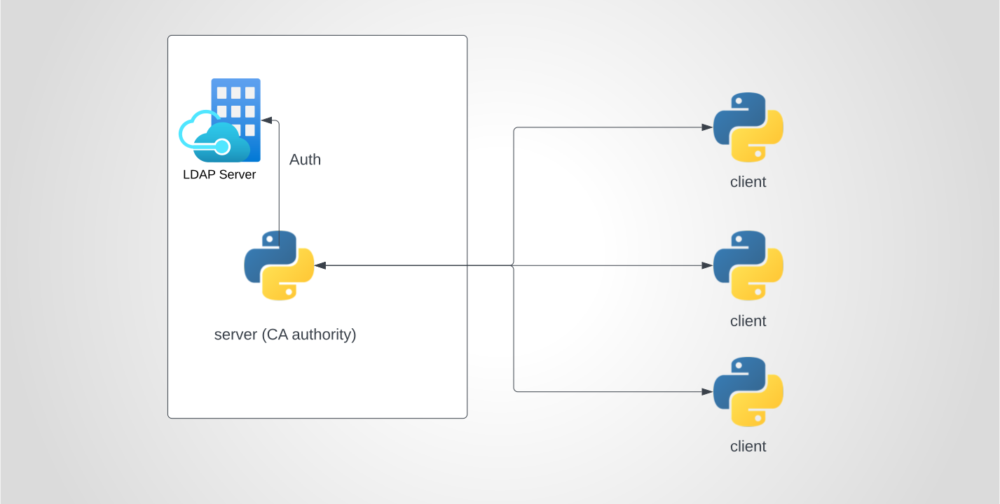

# end to end encrypted chat with LDAP authentication
- authentication using **Apache Directory Studio (LDAP)**
- client generates private key and certificate signing request
- the CA (server.py) stores a signed certificate for that user
- when a client wants to send a message to another destination:
  1. first it requests the destinations certificate from the server
  2. then it encrypts the message using its public key and sends it to the server
- when a client receives an encrypted message:
    1. it decrypts it using its private key

### Architechure

### proof of concept
[youtube link](https://youtu.be/5nD8e4gt9ac)

